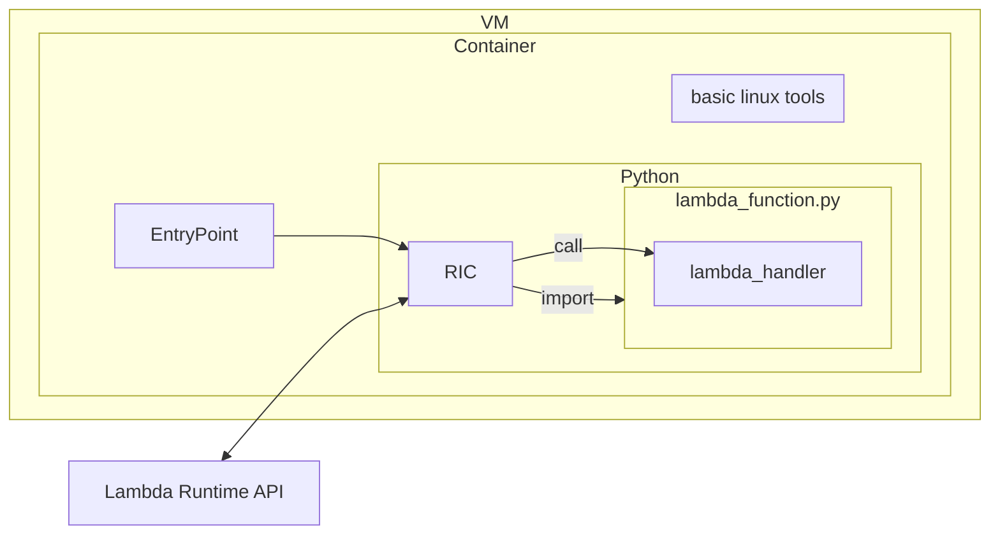

# Preface

This document describes all the basics and some behind the scenes about AWS’s
Lambda service. The information presented here will probably come into play
if you use Lambda sooner or later, so you are advised to read through the
entire article and don’t skip to parts you are interested in right now.

We will mostly use Python as our example. Other languages work similarly.

# Table of content

1. [Overview](#overview)
2. [What can it do](#what-can-it-do)
3. [How to call](#how-to-call)
4. [Configuring](#configuring)
5. [Cold and warm start](#cold-and-warm-start)
6. [Pricing](#pricing)
7. [Parallelism](#parallelism)
8. [Layers](#layers)
9. [Versioning](#versioning)
10. [Using containers](#using-containers)
11. [Limits](#limits)
12. [Under the hood](#under-the-hood)

# Overview

Lambda is a piece of program code that runs “nowhere”. You don’t need to
allocate a Virtual Machine, or a container. You just upload (or type in)
your code, and it can be executed whenever it is needed.

The purpose might be a lot of things: backend for an API, reacting to certain
events, doing something regularly, managing other cloud assets like VMs,
doing ETL, and so on.

The name “lambda” (somewhat of a misnomer) suggests that it is “stateless”,
i.e. it can’t have permanent data in files or global variables, as they will
(probably) not be there the next time your code is executed. You still can
have permanent data, but you have to store it somewhere else.

Lambda functions are really quick. If your code is simple, you can expect a
maximum of a few hundred milliseconds delay before the execution starts. It
of course slows down if your function is many megabytes in size, or uses a
dozen of large libraries.

Lambda functions can also be quite fat, you can do relatively large
computations with them. Think of 10G RAM, 5 CPU cores, 10G disk space, and a
few minutes of execution time. It might not be the most economical of
choices, but an option regardless.

# What can it do

Since a Lambda Function can’t store data in files or local databases, how do
you even use it? What can it do?

## Calculate

When invoked, Lambda can take a parameter. Thus you can give Lambda a piece
of data to work on. The input is an arbitrary json / dict object of any depth,
obeying some not so restrictive size limitations. It can also give back a
similar output. This means you can use Lambda to calculate something.
This can be as simple as basic text manipulation or input validation, or as
complex as a machine learning model or image processing.

## Access the internet

Lambda functions have access to the internet. You can access web pages or web
APIs, for the purpose of health checks or scraping.

## Access your cloud assets

AWS itself is a Web Service, everything you can do with it can be done via
API calls. Typically you would not do these calls yourself, but use a Python
module called boto3. With boto3, you can do anything you can with the
Console: you can start or stop VMs, read files from S3, access DynamoDB,
etc. In fact, DynamoDB is a particularly nice place to store permanent data.

# How to call

This is by far not a complete list of ways a Lambda Function gets called,
but the most typical ones.

## Event

Many AWS resources emit notifications when something happens. This includes
an upload to an S3 bucket, commit to a CodeCommit repo, shutdown of an EC2
instance, and so on.

You can configure EventBridge to listen to such events, and call a Lambda
function when they happen.

EventBridge can also call functions on schedules, akin to “cron”.

## API Gateway

API Gateway is a definition layer for REST or REST-like APIs, which can do
request parsing and authentication, but will not do actual implementation,
only forward the processed request to some backend. The backend is typically
one or more Lambda functions.

## Function URL

Functions can be published over the internet, and directly invoked by any
3rd party via HTTPS. The URL will be some ugly AWS domain, you can’t use
your own domain.

## CloudFront

There are two ways Lambda can be used together with CloudFront. Lambda can be
a CloudFront Origin, provided you create a Function URL first. This is a
simple alternative to API Gateway for creating APIs, in case you don’t need
the extra functionality of it.

CloudFront can use Lambda functions to pre- or postprocess requests. This is
called “behavior” in CloudFront lingo. When you use Lambda for this reason,
your function will be kidnapped and deployed to different AWS regions behind
the scenes, a process known as Lambda@Edge. There are a number of
restrictions that apply for this use case, so be warned. Check them out
[here](https://docs.aws.amazon.com/AmazonCloudFront/latest/DeveloperGuide/edge-functions-restrictions.html#lambda-at-edge-function-restrictions)
and [here](https://docs.aws.amazon.com/AmazonCloudFront/latest/DeveloperGuide/cloudfront-limits.html#limits-lambda-at-edge).

## CLI, boto3, console

You can manually or programmatically start your functions using the AWS
Lambda Invoke endpoint ([documentation](https://docs.aws.amazon.com/lambda/latest/dg/API_Invoke.html)),
which you probably don’t want. Instead, you can use

* the AWS Console if you prefer a UI, 
* boto3 from your Python program ([documentation](https://boto3.amazonaws.com/v1/documentation/api/latest/reference/services/lambda/client/invoke.html))
* the CLI from the command line or shell scripts ([documentation](https://docs.aws.amazon.com/cli/latest/reference/lambda/invoke.html))

When invoking a function, you can wait for the response, or you can trust
AWS to run the function eventually, and go on with your activities without
waiting. The former is called synchronous, and latter is called asynchronous.

# Configuring

This section describes the configuration options that are essential to
understand in order to develop working and safe Lambda Functions.

## Timeout

All Lambda functions have a maximum runtime, after which they will be
forcefully aborted. You can set it to any value up to 15 minutes. The
runtime is hard capped at 15 minutes, and there is no way around it. Be
aware that the default is 3 seconds, which might be not enough in your use
case. It is advisable to set it to a reasonable value, so in the rare case
of your function going awry or freezing, you are not paying for 15 minutes
of nothing.

## Role

If your code works with any AWS resources, you will have to grant access to
them. The way to do this is to set up an IAM role, and attach that role to
the function. Even if you don’t want your function to work with AWS resources,
typically you would grant it write access to CloudWatch Logs, because Lambda
always tries to record its invokations and any potential errors.

You can use a dedicated role for the function, or you can reuse the same role
for multiple functions. Please never assign an administrator role just
because you are lazy.

## Memory and CPU share

Crucial to understand that there is a single setting for both the memory
allocated and the CPU share you are getting. The CPU share is a hard limit,
and the default setting (128MB) will give you around 7% of a single CPU.
Don’t be surprised if otherwise fast programs run very slow.

The CPU share scales linearly with the memory. You will have one full CPU
core at approximately 1800MB. Above that, you’ll get more than one CPU cores,
which will not be of any advantage for a simple Python program, but can be an
advantage if you use multi-threaded libraries, or you yourself use e.g.
ThreadPoolExecutor.

The memory/cpu setting greatly influences the cost of Lambda. Please check
the pricing section for more information.

## Temporary disk space

If you are planning to download files, unpack archives, assemble files for
uploading, you might need temporary disk space. By default AWS gives you
512MB accessible at /tmp. But keep in mind that you share this space with
all modules and binaries you are running, and they might put files there
too. If you want to work with large files, make sure you have some extra
room.

## Environment variables

You don’t want to include references to AWS or external resources in your
Lambda code, because if they change, you’ll need to redeploy the function.
If you use any IaC, you can’t conveniently include references in the code at
all, since you don’t know their names in advance. Also, you might want to
create test versions of the same code, or run locally, supplying test
versions of the resources. Finally, if resource references are scattered
around in the code, you or other developers might not even know about them,
they are hard to find.

Thus all such references should go into parameters, which are what
Environment Variables are for. They indeed become environment variables in
the system at runtime, so you can access them via `os.environ`.

# Cold and warm start

When Lambda executes your function, it will not immediately unload it, but
keep it around for a little while, in anticipation it will be needed again.
When the environment is not loaded, and needs to be loaded, we call that
“cold start”. When it is loaded already, we call the environment “warm”. This
has two major implications.

One is that you might (and encouraged to) save time by doing the
initialization outside the function. That code will only be executed when the
environment is created, and not for all invokations. Consider the following
code.

```python
    import boto3
    
    bucket = boto3.resource("s3").Bucket(os.environ["bucket"])
    bucket.download_file("mydata", "/tmp/mydata")

    def lambda_handler(event, context):
        # use the file /tmp/mydata
```

The code outside the handler will be executed only when the environment is
cold.

The other is that you need to be careful not to “litter” your environment.
If you leave data in the /tmp folder, it will pile up over time. If you use
global variables, their values might be retained between calls. But also keep
in mind that you can’t rely on it. It can happen at any time that AWS decides
to launch a new cold environment, and execute your function in it. You have
to be prepared for both cases.

If cold starts are particularly troublesome in your application, you can
purchase Provisioned Concurrency. With it, you pay AWS for keeping pre-warmed
environments at the ready at all times.

# Pricing

The price is region dependent, but roughly the same in the large regions. The
price of a single invokation, in US dollars, is as follows:

    0.0000002 + 0.0000166667 * m * t

Where `m` is the sum of your memory setting and the temporary disk setting
above 512MB, in gigabytes, and `t` is the execution time in seconds.

As an example, if your function is set to 1800MB, and runs for a 100ms, the
price is

    0.0000002 + 0.0000166667 * 1800 / 1024 * 0.1 = $0.0000031297

This price only applies if you do a lot of invokations, because there is a
sizable free tier. The first fix term will only be billed after a million
invokations per month, and the second term will be only billed for `m*t` above
400,000 a month. But keep in mind that the free tier is for a whole account,
not per function.

A somewhat important note is that you are only billed for the invokation time,
not for the startup time. This, until your startup time exceeds ten seconds,
in which case you will be billed for that too. This is another good reason to
move as much code to the initialization part as possible.

On top if this, you also pay for network traffic out from the AWS network to
the internet. It is typically negligible, but keep in mind if you upload a
large amount of data somewhere.

To calculate quickly in head, you should consider the second term, which
typically dominates the cost. Estimate the average execution time, multiplied
by the memory setting in gigabytes, and you get 60,000 of these for a dollar.
E.g.:

    Memory size: 1800MB ≈ 1.8 GB
    Average execution time: 250 ms
    Product: 0.45 GBs per call.

If you’ll have a million invokations a month, that will be 450,000 GBs, or
7.5 dollars, not counting the free tier. If this is your only function, almost
all of it will be free, you pay only for 50,000 GBs which is under a dollar.

Note that some pages on the internet will show you in excruciating detail
how to optimize the memory setting to minimize cost. This is not necessarily
good advice though, because the savings are typically very small, while the
user experience might matter more. Unless you are really cost constrained,
or performance indifferent, you should consider responsiveness as a primary
target. Going with 1800MB as the default will suffice in most circumstances,
adjust only when this particular line on your bill matters.

# Parallelism

Lambda is inherently parallel. If you invoke a function many times in rapid
succession, AWS will create multiple instances of the function, and
distribute invokations between them. Up to a 1000 instances can be created,
although new accounts will only get 50, which will ramp up according to some
automated limit increase. If you want an immediate limit increase, or even go
beyond the default 1000, you should contact support.

You can restrict parallelism via Reserved Concurrency. Reserved Concurrency
means you isolate a pool of your current limit (say 10 out of the 1000), and
dedicate that to a function. This has two consequences: that function will
never get more than the allocated number of instances, but also that number
will be removed from the global pool. Using the above numbers as example, all
your other functions now share 990 available slots. Reserved Concurrency is
typically used to protect some backend infrastructure. For example if the
function accesses some database, and the database can only handle so many
connections at a time.

You should also understand that concurrency will not increase suddenly from
zero to hundreds. There is a ramp up process if invokations start coming in.
This might result in throttling or failures if the rise is very sharp.

# Layers

Somewhat a misnomer, Layers actually are just a set of files that can be
reused between different functions. You can attach these “layers” to a Lambda
function, maximum of five, to combine their content with the function’s own.

You can use layers to hold Python modules, or 3rd party software, or data
files. Layers can’t contain other layers.

The layers are purely an organizing tool. There is no significant difference
between including all necessary files in the function itself, versus
including in a layer. In particular, once a layer is added to a function, it
will become part of the deployment package, and will not reflect any
subsequent changes to the layer. If you change a layer’s content, you have
to redeploy all functions using it. You can even delete the layer, and it
won't affect the functions.

Layers will also not bypass deployment size limitations. The combined package
size, layers plus lambda, must be below the limit.

Layers’ content will be placed in the /opt directory. If you include Python
modules in a layer, place them in a subdirectory named `python`, because the
Python in Lambda will look for modules in the `/opt/python` directory, but not
in the `/opt` directory.

# Versioning

Lambda functions can be versioned, and whenever you can specify which Lambda
to call, you can also specify which version to call. Versioning comes in two
flavors: version numbers of aliases.

A Lambda version consists of the function code, and all the relevant
configuration. These can’t be changed later, but can be deleted. You can
turn the current code + configuration into a numbered version by publishing
it. Publishing will automatically assign a new number, starting with 1. The
code itself is not considered versioned, and doesn't have a number. Version 1
will be created when you publish a version the first time. Publishing a new
version will not delete the old versions, all of them will be kept around,
and will be callable.

If you want to call a version, you add a colon and the version number after
your function. For example if your function is called `MyFunction`, 
`MyFunction:2` would be its second published version. You can include this
name in the arn as well.

Versions can be labeled. The label is a simple text, obeying some rules, but
otherwise freely chosen. For example you can label a version “production” or
“test”. Labeled versions can be called similarly to numbered versions, e.g.
`MyFunction:test`. The major difference is that labels can be moved around.
You can switch “test” from version 2 to 3, for example. This way, you can
make a caller always call the latest tested version, whichever it is.

There is a special label, “$LATEST”, which doesn't point to any version, but
the actual code. This is a pseudoversion, and can be used in situations
where a version label is mandatory, but versioning is not wanted.

There is also support for “canary” deployment, which means calls will be
directed toward the new release candidate in a slowly increasing rate, but in
case of errors, the deployment is canceled, and the old version is fully
restored.

# Using containers

If you want to use 3rd party software, which requires installation, you can
use Docker or OCI compatible containers. The image must be registered with
ECS, and must be based on Linux. AWS provides base images which you can
extend. This is an advanced topic, thus will not be covered here, but we
just forward you to the
[documentation](https://docs.aws.amazon.com/lambda/latest/dg/images-create.html).

# Limits

There are a number of limitations to your function size, etc, which we are
not going to list here, just include the link to the
[documentation](https://docs.aws.amazon.com/lambda/latest/dg/gettingstarted-limits.html).

# Under the hood

This is not a complete description, just the gist of it. More details are
available in the [documentation](https://docs.aws.amazon.com/lambda/latest/dg/runtimes-custom.html).

Lambda runs, as everything on AWS, in VMs. The VM is running Amazon Linux.
The exact version depends on the chosen environment, for Python 3.9, it will
be Amazon Linux 2. The actual environment is containerized, and only some
essential linux tools are available. Of course, Python is also available,
with some basic modules installed. All file systems are read only, except
`/tmp` is mounted to a temporary file system, and is writable.

A Python module called `awslambdaric` is also installed, which implements the
Lambda Runtime Interface Client (RIC). This module is set as the entry point
of the container. The RIC will do a bunch of bootstrapping, and then
eventually import your main file. At this point, your initialization code is
executed.

After that, the RIC will poll for tasks to do. It is achieved via a locally
accessible HTTP server, from which you can get the next invokation. When an
invoke event happens, the RIC will read the given input, assemble some
context information, and call your lambda handler.

Upon completion, the RIC will use the same HTTP interface to report success.
If an exception is raised, the RIC will report failure similarly.

Then the RIC will query another invokation. This will continue in an infinite
loop, until eventually AWS terminates the container.

There are some important implications of this setup.

First, you can execute basic Linux commands with for example `os.system`.
However, not many commands are available. In particular, the `yum` package
manager will not be available, nor git or systemd for example. The AWS CLI
is also not installed, you have the `boto3` module instead. Also keep in
mind that Amazon Linux is in the RHEL family, so things might differ from
the Debian lineage.

You can install programs from the internet, or include in the package as
files, but you can only write in the /tmp directory, and you will not have
other than the most common libraries. You will not be able to install
libraries in /bin or other locations.

You can install Python modules with pip. You have to specify `--target /tmp`
or a subdirectory of it. This is not the intended way of using Python modules,
but it might be a nice way to install the exact right versions of modules in
a real environment, and then upload them to S3 for later use in your actual
Lambda Function or Layer.

The second implication is that once your code starts, Python has already done
quite some setup. You are not running in a clean, fresh Python environment,
you are a “plugin”. For example any operation that needs to be done early on
in the application startup will be too late by the time you get a chance. Or
an error reporting tool that catches unhandled exceptions will never catch
anything, because the RIC will catch all exceptions.

The RIC will also set up logging, which means that you can’t change the
logging configuration. You can use the logging module though to write to
CloudWatch logs.

Thirdly, you can actually do work between Lambda invokations. If you start
some background process, for example using threads, or spawned processes, it
will not be immediately interrupted upon returning. You can prefetch or
precalculate some data, anticipating an upcoming execution. However, there
are no guarantees. AWS can terminate the environment at any moment.

Feel free to experiment. The environment is yours to play with. It is well
isolated, you can’t screw up anyone else’s work. You can also install the
`awslambdaric` module in your Python to have a look, but it will not function
properly outside of the AWS infrastructure, and will not even be complete on
Windows, since most of its implementation is in a compiled library.

Note that you don’t have to use the AWS provided RIC. You can implement the
event pumping yourself, as described
[here](https://docs.aws.amazon.com/lambda/latest/dg/runtimes-custom.html).


